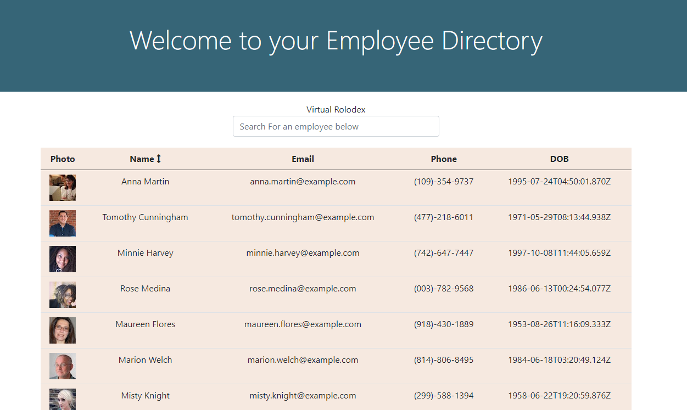
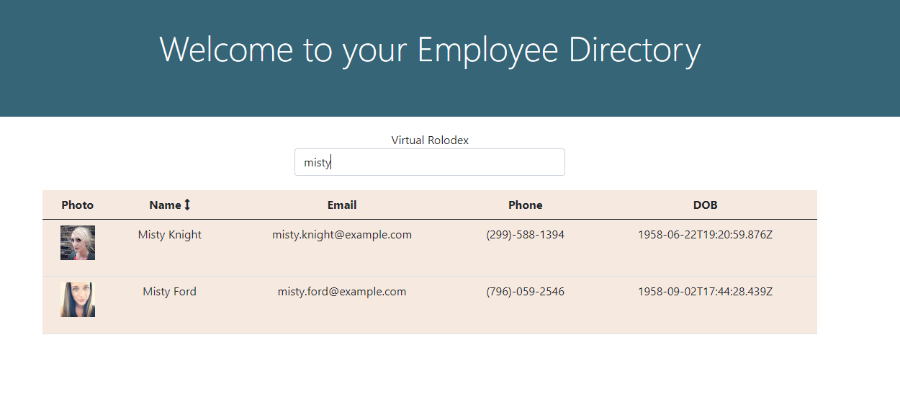

# Employee_Directory_WalterMcCone

  ## Description

 I created this Employee directory as a way to simplify the management of a companies directory and org chart. Every company whether its 5 employees or 5000 employees needs a simple way to look up current employee information. This application is designed for Human resource departments or team managers to simplify the process of keeping track of their team members. This directory is a react app that allows the user to quickly search and sort the table by the name of the employees. 

  ## Table of Contents

  * [Installation](#installation)
  * [Usage](#usage)
  * [License](#license)
  * [Contributors](#contributors)
  * [Questions](#questions?)
  * [Tests](#tests)

  ## Installation

  Go to the [deployed app](https://wmccone-employee-directory.herokuapp.com/)

  ## Usage

  When you are on the application you can search for employees by name by typing the name of the employee into the search box. You can also click the header of the name column to sort the list by descending order or click it again to sort by ascending order.

  

  
  

  ## License

  

  ## Contributors

  N/A

  ## Questions?
  Follow me on Github
  [wmccone](https://github.com/wmccone) 
  or 
  email me at gerrymccone88@gmail.com

  ## Tests

  N/A

